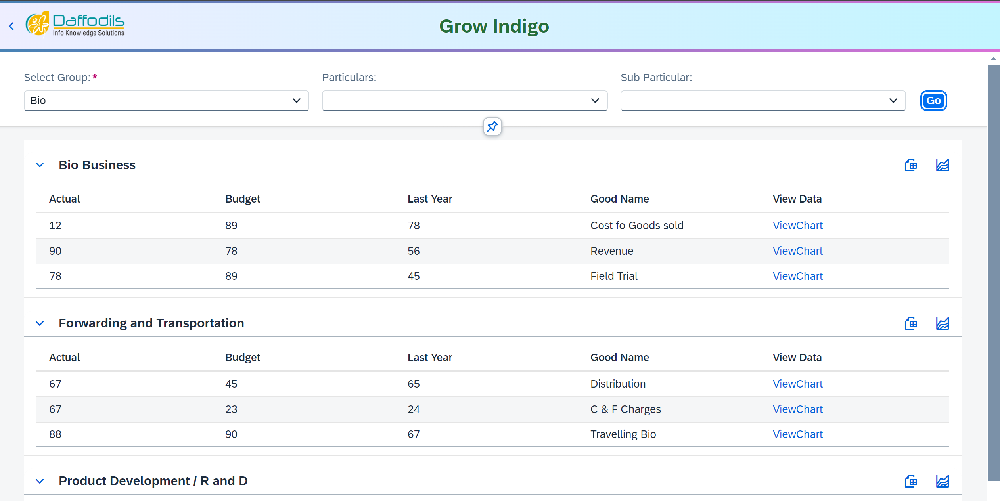
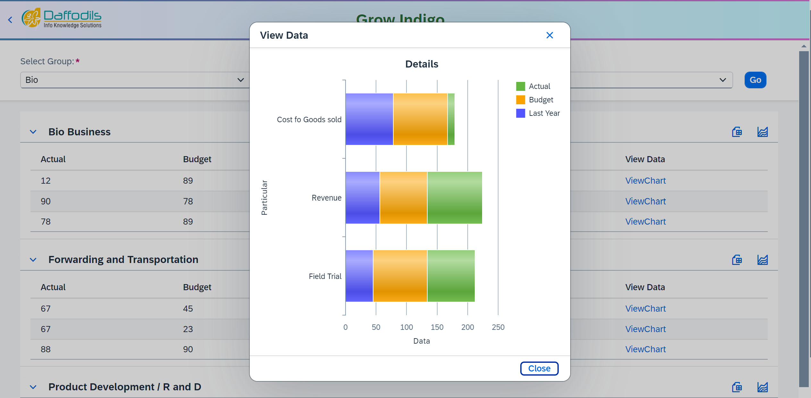
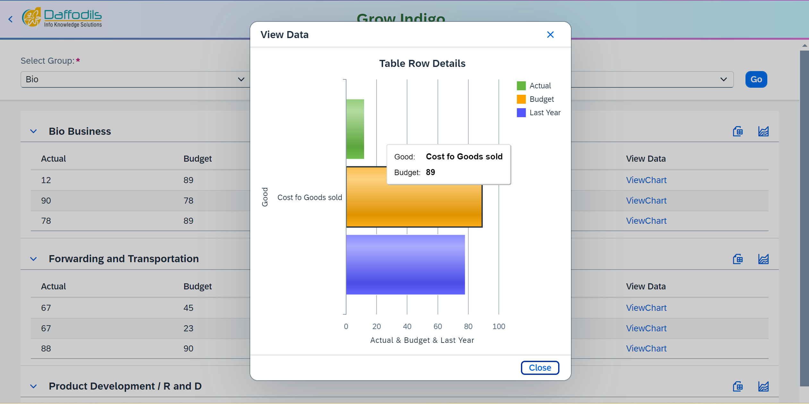
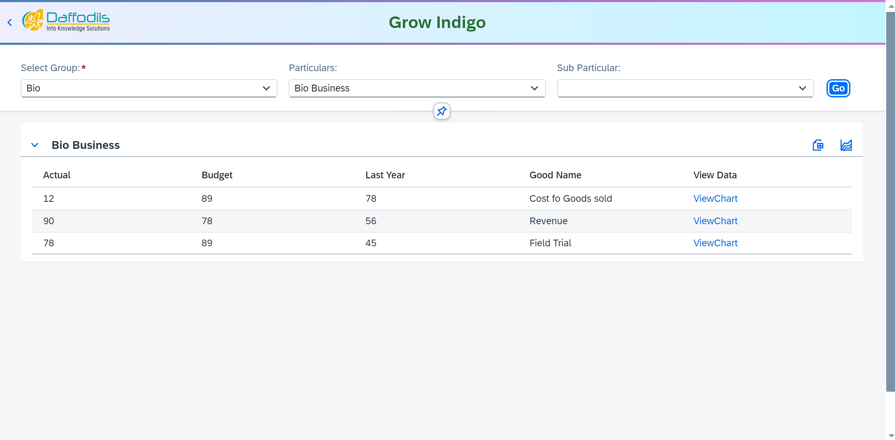
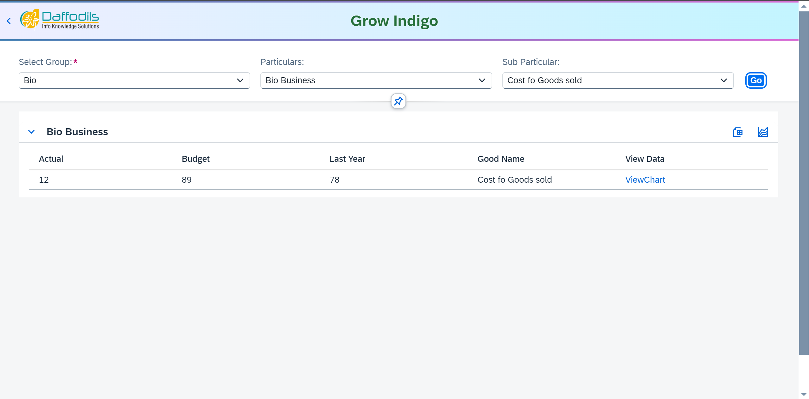
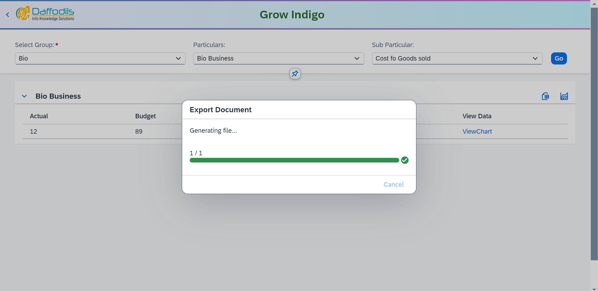
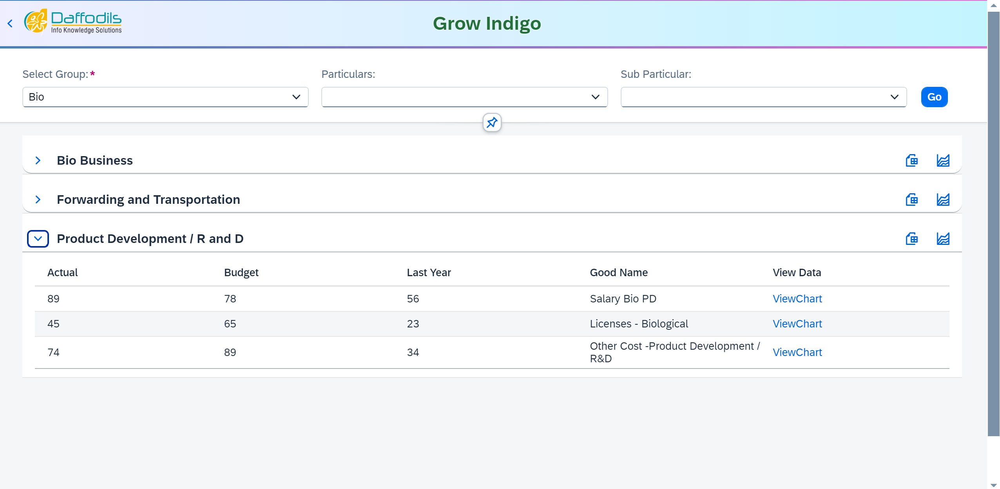

# MIS-Dashboard
Data representations
<h3>First Select Group Name</h3>

<h3> Click go btn show all group data</h3>

click chart icon for see particular bio business data

<h3>This image show bio business data</h3>

click ViewChart link for see single bio business data

<h3>This image show bio business single data</h3>

for extra filter for bio data select particulars input

<h3>This image show group bio data for filter particulars selection</h3>

<h3>This image show group bio data for filter sub particulars selection </h3>

<h3>Click excel icon for download data</h3>

<h3>expandable functionality</h3>

<h1>----------------End--------------------</h1>